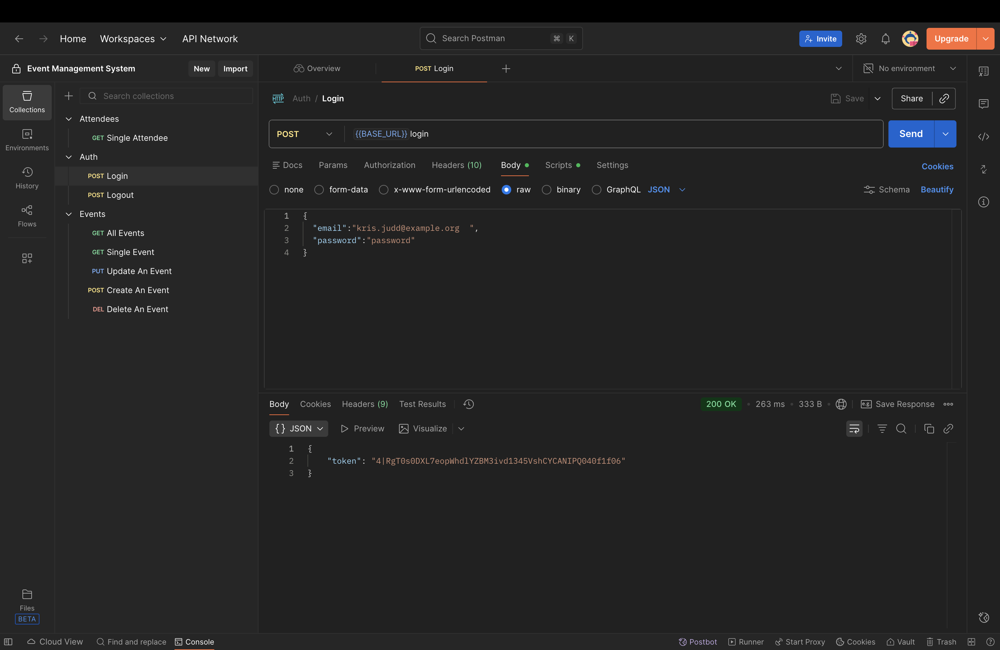
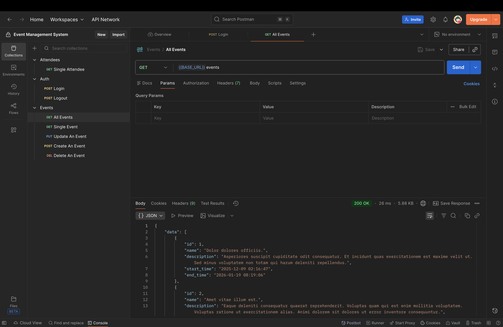
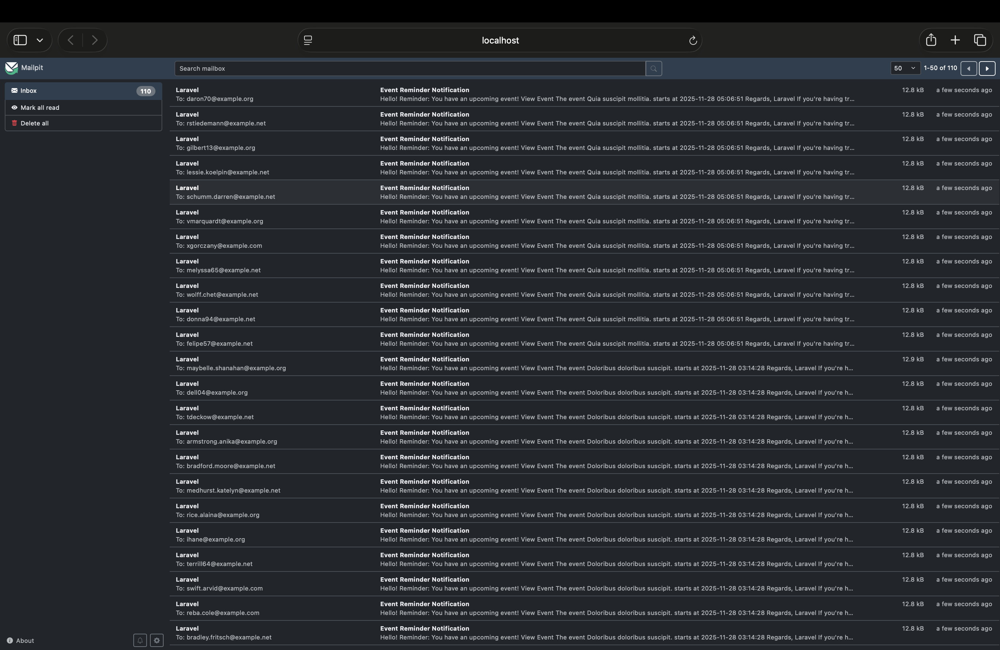
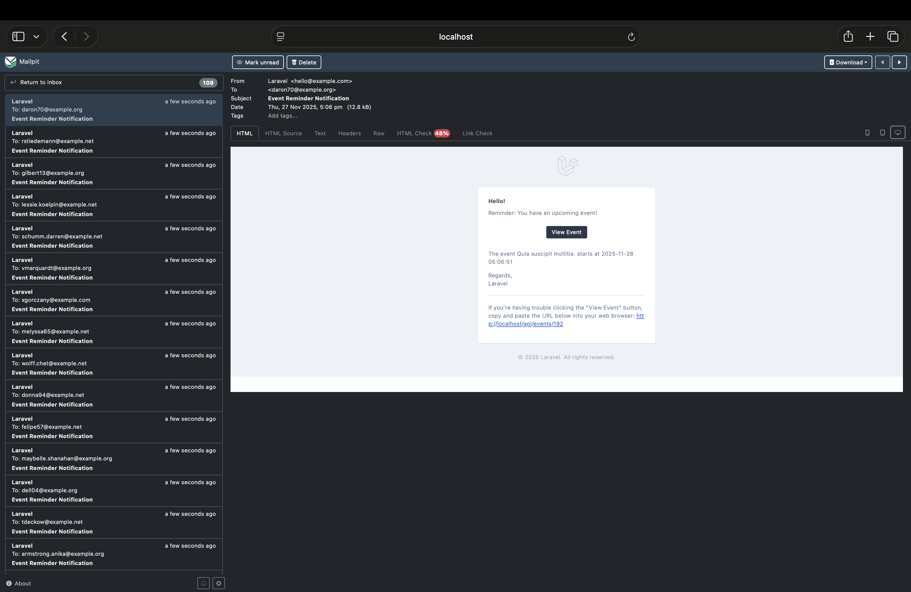
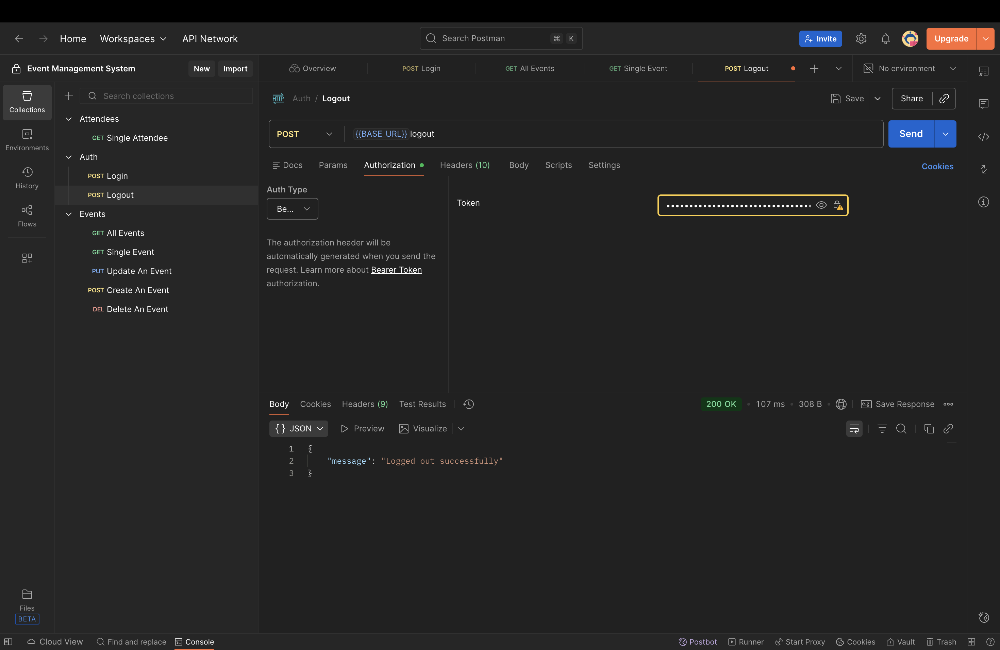

<!-- First row: 2 images -->

  

    <h3>Login</h3>
    
  

  

    <h3>Events</h3>
    
  

<!-- Second row: 2 images -->

  

    <h3>Invitations</h3>
    
  

  

    <h3>Mail</h3>
    
  

<!-- Third row: 1 image centered -->

  

    <h3>Logout</h3>
    
  

